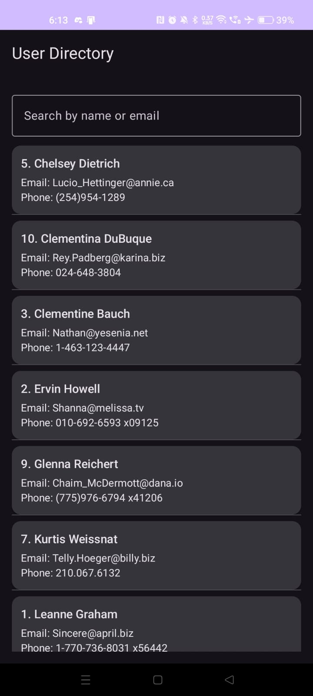
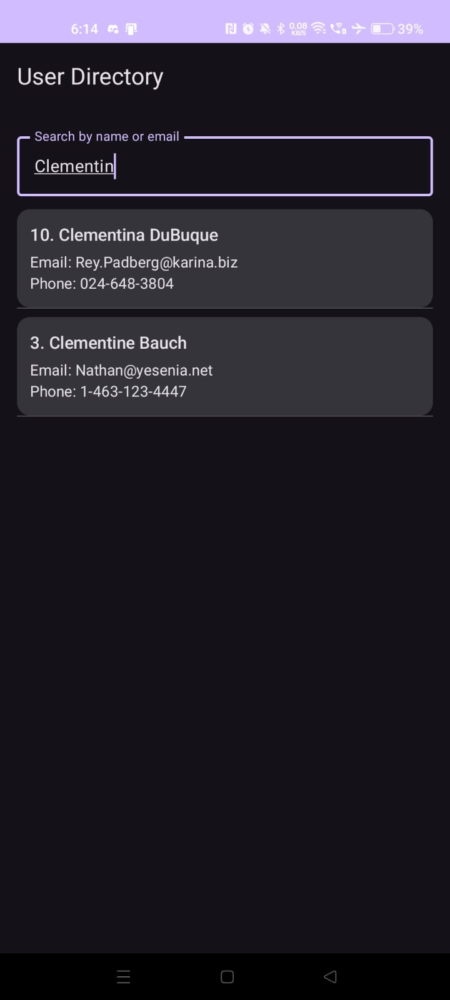
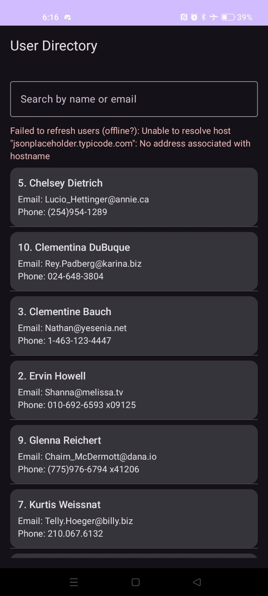

# User Directory – Offline-First Android App

This project is an offline-first **User Directory** Android application built using **Kotlin, Jetpack Compose, Room, Retrofit, Coroutines, and MVVM architecture**. The app fetches user data from the JSONPlaceholder API, stores it locally using Room, and displays the data even when the device is offline.

---

## 🚀 Features

### ✔ Fetch Users from Public API (GET only)
- Uses Retrofit to call the endpoint: `https://jsonplaceholder.typicode.com/users`
- Retrieves 10 user objects (id, name, username, email, phone, website)
- GET ONLY — no POST/PUT/DELETE, as required

### ✔ Local Caching with Room (Single Source of Truth)
- User data is stored in a **Room Database**
- `@Insert(onConflict = REPLACE)` keeps cached data updated
- UI always reads from Room using **Flow**
- API results are NEVER displayed directly

### ✔ Offline-First Architecture
- On app launch:
  1. Displays cached Room data instantly  
  2. Attempts API fetch  
  3. On success → updates Room  
  4. UI auto-updates through StateFlow  
  5. On failure → cached data continues to display  
- Fully usable without internet after first successful load

### ✔ Local Search (Room SQL Query)
- Search by **name** or **email**
- Implemented using SQL `LIKE` query inside DAO
- Search is fully local (NO API calls)
- Works both online and offline

### ✔ Modern Compose UI
- Displays id, name, email, and phone number
- Includes a search bar, error messages, and loading UI state

---

## 📱 Screenshots


### 1️⃣ User List (Online Mode)


### 2️⃣ Search Function


### 3️⃣ Offline Mode (Cached Data)



---

## 📦 Tech Stack

- **Kotlin**
- **Jetpack Compose**
- **Room Database**
- **Retrofit + Gson**
- **Coroutines (Flow & suspend functions)**
- **MVVM Architecture**
- **StateFlow for reactive UI state**

---

## 🧩 Architecture Overview

```
UI (Jetpack Compose)
        ↓ (collects StateFlow)
ViewModel
        ↓ (calls repository)
Repository
   ↙                 ↘
Room (Local DB)    Retrofit (Remote API)
```

- UI subscribes to database updates via Flow  
- Room is the **single source of truth**  
- Repository syncs API → Room  
- ViewModel exposes clean UI state to Compose  

---

## ✨ Implementation Summary

This app fetches user data from the JSONPlaceholder API using Retrofit and stores it in a local Room database, making Room the single source of truth. It implements an offline-first pattern where cached users display instantly, and data refreshes automatically when network connectivity is available.

---

## 📥 How to Run

1. Clone the repository:
   ```bash
   git clone https://github.com/hisham-pk3/UserDirectory.git
   ```
2. Open the project in **Android Studio Koala or newer**
3. Ensure **JDK 17** + the **Compose Compiler plugin** are configured
4. Run the app on a device or emulator

---

## 📚 Project Structure

```
app/
 └── src/main/java/com/example/userdirectory/
      ├── data/
      │    ├── local/ (Entity, DAO, Room Database)
      │    ├── remote/ (Retrofit API service)
      │    └── UserRepository.kt
      ├── ui/ (Compose UI + ViewModel)
      └── MainActivity.kt
```

---

## 👤 Author

**Hisham Panamthodi Kajahussain**  
CPSC 411A – Android Development  

---

## 📎 Submission Info

This is an **individual assignment**, submitted with:
- GitHub repository link  
- App overview  
- Required screenshots  
- Two-line core functionality description  

```
👉 GitHub Repo: https://github.com/hisham-pk3/UserDirectory.git
```

---

